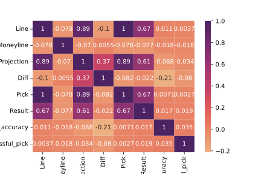
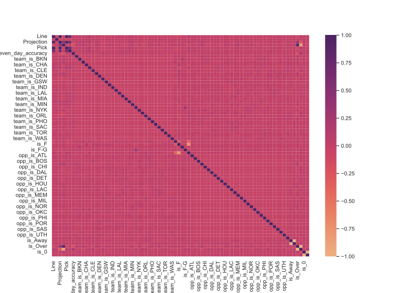

## Finding Arbitrage in NBA Betting

The goal of this project is to produce a model that can predict NBA scoring performances more accurately than the consensus line being offered. A secondary objective is to identify the features with the most predictive power.

To start exploring this goal, I used looked at the correlation between our target variable (result), and the features present in the baseline data.

The results have some promising features, such as Projection and Line.

Next, I one hot encoded all of the features in our betting dataset (except name), and fit a basic regression model (R2 = .45 -- not bad for baseline!)

And looked for any standout correlations in the subsequent heatmap

Next steps will be to deepen the scrape function for a more complete dataset, join the team and player data, engineer a number of rolling average and trend-style features on that dataset, merge it with the betting data, clean the dataset, fit a LassoCV model, pick the top feautres, and re-run with OLS Regression model.
